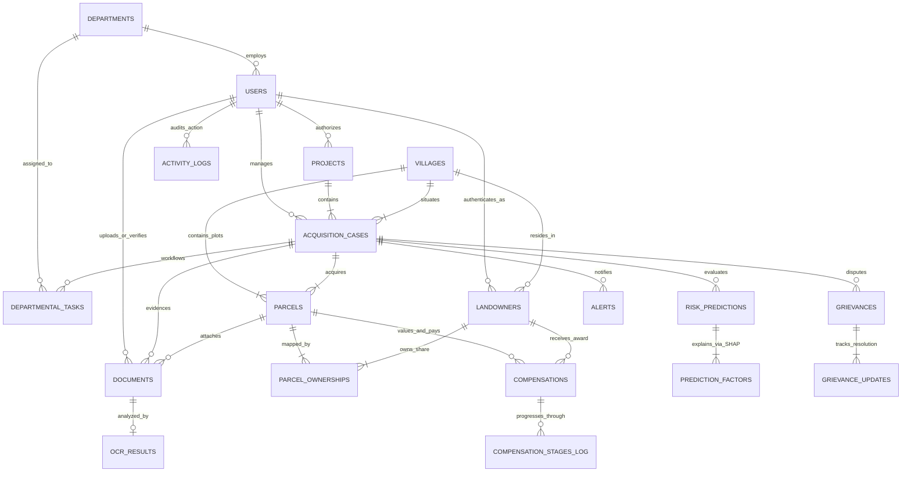

# BhoomiSetu AI — Database Entity-Relationship Diagram (ERD)

## Primary Entity Key Hierarchy
- **Project**: Macro-infrastructure level (Highways, Rails, Canals).
- **Village**: Cadastral survey unit within Tahsil/District.
- **Acquisition Case**: Administrative statutory file tracking notification sections (4(1), 6(1), 11(1), 19(1), Award) and overall delay probability.
- **Land Parcel**: Physical plot polygon with Plot No, Khata No, Land Type, and Valuations.
- **Landowner**: Legal titleholder / co-sharer receiving compensation awards.
- **Documents & OCR**: Digital Patta / RoRs scanned for discrepancies.
- **9-Stage Compensation**: Milestone-driven award payment tracking.
